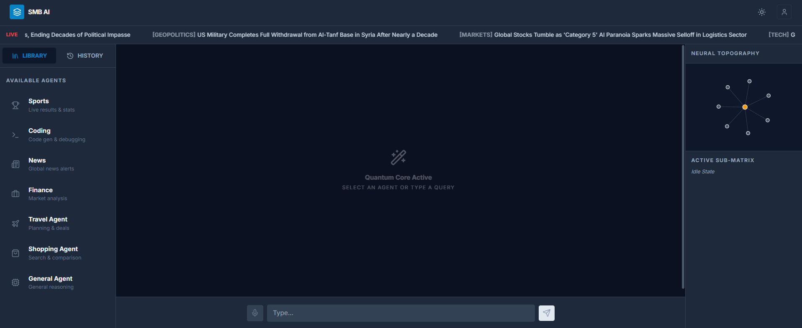

## 📸 Product Preview



# 🤖🧠 Multi-Agent AI System

> A modular, scalable **Multi-Agent Architecture** built with **React + TypeScript + Vite** that
> simulates intelligent collaboration between autonomous AI agents, evaluators, and orchestration services.
> This project demonstrates how modern AI systems move beyond single-model responses into coordinated, multi-agent workflows.

---

# 🌟 Why This Project?

Modern AI systems are shifting toward **agent-based architectures**.

Instead of one model doing everything:

- 🧠 Agents specialize
- 📊 Evaluators validate
- 🔁 Services orchestrate
- 💻 UI visualizes execution flow

This project simulates that complete pipeline.

---

# 🏗️ System Architecture

## 🧩 1️⃣ Agents Layer (`/agents`)

Each agent:

- Has a defined responsibility
- Processes assigned tasks
- Generates structured output
- Operates independently

Example responsibilities:
- 🔎 Research Agent  
- ✍️ Content Agent  
- 🧮 Logic Agent  
- 🛠️ Execution Agent  

Agents are modular and easily extendable.

---

## 📊 2️⃣ Evaluators Layer (`/evaluators`)

Evaluators:

- Score agent responses
- Validate correctness
- Provide feedback
- Improve reliability

This creates an internal quality control loop.

---

## 🔄 3️⃣ Services Layer (`/services`)

The orchestration core of the system.

Responsibilities:

- 🧠 Manage execution order
- 🔁 Handle multi-step workflows
- 📡 Coordinate communication
- ⚙️ Maintain system state

This layer ensures scalability and maintainability.

---

## 🎨 4️⃣ Frontend Layer (`/components`)

Built using:

- ⚛️ React
- 🟦 TypeScript
- ⚡ Vite

Features:

- Interactive interface
- Real-time task visualization
- Structured output rendering
- Modular UI components

---

# 🛠️ Tech Stack

| Technology | Purpose |
|------------|----------|
| ⚛️ React | UI rendering |
| 🟦 TypeScript | Type safety |
| ⚡ Vite | Fast build tooling |
| 📦 Modular Architecture | Scalability |
| 🧠 Agent-Based Design | Workflow simulation |

---

# 🚀 How It Works (Step-by-Step)

1️⃣ User provides input  
⬇  
2️⃣ Service layer receives request  
⬇  
3️⃣ Task delegated to appropriate agent  
⬇  
4️⃣ Agent generates structured output  
⬇  
5️⃣ Evaluator validates response  
⬇  
6️⃣ Final result displayed in UI  

This mirrors real-world AI orchestration systems.

---

# 📂 Project Structure

```
├── agents/           # AI agent modules
├── evaluators/       # Validation logic
├── services/         # Orchestration layer
├── components/       # UI components
├── App.tsx
├── index.tsx
├── metadata.json
├── types.ts
├── vite.config.ts
└── package.json
```


---

# 🎯 Key Features

✨ Modular multi-agent architecture  
✨ Clear separation of concerns  
✨ Evaluation feedback loop  
✨ Type-safe implementation  
✨ Scalable folder structure  
✨ Production-ready configuration  
✨ Extendable agent system  

---

# 🔮 Future Enhancements

- 🧠 Persistent agent memory
- 🌐 LLM API integration
- 🔄 Real-time multi-agent collaboration
- 📊 Advanced evaluation metrics
- 📈 Monitoring dashboard
- 🚀 Cloud deployment

---

# 📌 What This Project Demonstrates

- 🧩 Clean architecture design  
- 🏗️ System-level thinking  
- 🧠 Agent-based AI modeling  
- 📦 Scalable engineering practices  
- ⚙️ Production-ready frontend structure  

---

# 💡 Ideal Use Cases

- AI workflow experimentation  
- Agent-based research systems  
- Portfolio demonstration  
- Internship project showcase  
- System design exploration  
